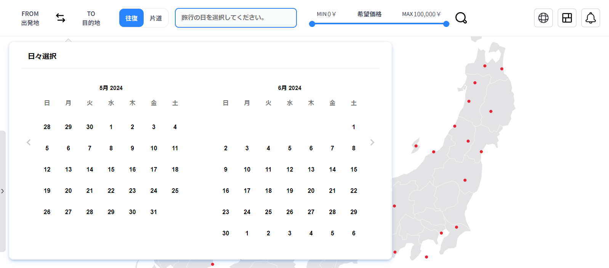

# Sidewalk

このプロジェクトは、日本と韓国の飛行に関する情報（航空券、空港、航空会社、為替など）を視覚化して提供するウェブサイトです。

## 紹介

日本と韓国を行き来しながら、航空券や為替データに関心を持つようになり、これらのデータを一目で見られるように視覚化したサイトがあれば便利だと考え、このプロジェクトを始めました。
新しい技術や開発の知識をこのプロジェクトに取り入れながら、様々なサービスを追加し、日本や韓国に興味のあるユーザーが便利に利用できるプラットフォームに成長させることを目指しています。

- 開発期間：2023年12月6日～2024年5月21日
- 開発人数：1

## Tech Stack

### Environment
<p>
    
    
    
    
</p>

### Config


### Development

<p>
    
    
    
    
    
    
    
    
</p>

### Deploy


### Communication


## Architecture

```plaintext
./
    | app
        | [locale]          ：ページフォルダ
        | api
            | airlines      ：航空情報
            | airports      ：空港情報
            | dashboard     ：ダッシュボード情報
            | flights       ：フライト情報
            | external-apis ：外部 APIs
    | components
        | atoms
        | molecules
        | organisms
        | templates
        | styles.ts         ：コンポネントで使用される共通スタイルを定義
    | hooks
        | providers         ：プロバイダー向けのフォルダ
        ...                 ：共通フックスが集まっている
    | messages              ：多言語対応のためのメッセージフォルダ
        | ja.json
        | ko.json
    | prisma
        | dummy             ：ダミーデータ
        | migrations        ：マイグレーションファイル
        | prisma.ts
        | schema.prisma
    | public
        | fonts
        | images            ：イメージファイル
        | map               ：日本と韓国の地図ファイルがある
        | svgs
    | store                 ：Clientグローバルステータスのフォルダ (Recoil)
    | styles                ：グローバルスタイル
    | types                 ：グローバルタイプ
    | utils
    ...
```

## Features

### ダッシュボード

    初めての画面であるダッシュボードでは、航空券と為替レートの情報を一目で確認できます。


#### 航空券

1. 日本と韓国の平均航空券価格
   - 今年の基準で日本行、韓国行のチケット価格を表示
2. 安い及び高い航空券の曜日
   - チケット価格のデータの基準で安い、高い曜日を表示
3. 明日の航空券のチケット
   - 明日の日本行、韓国行安い往復のチケットを表示
4. オススメの旅行先
   - 人気がある旅行先の情報を表示 (まだ、機能追加されてない)
5. オススメの旅行チケット
   - ランダムでチケットを表示
   - クリックし、フライトページに遷移 (まだ、機能追加されてない)
6. 航空券の平均価格グラフ
   - 現在の基準で前後一週間のチケットの価格をグラフで表示

#### 為替

1. 日韓間の為替レート

   - USD基準で日韓間の為替を表示
   - 為替の右で昨日との為替を比べて増減数値を表示
   - 更新された時間データを表示

2. 円とWONの為替が高い、安い時の価格
   - 今月の基準で為替の安い時、高い時の価格を表示
3. 為替計算機
   - 現在の為替基準で計算した値を表示
   - 円からWON、WONから円に交換ができる
4. 為替グラフ
   - 国を選択する事ができ、選択されたデータを表示
   - 年、月、日の選択ができて時間的なデータを表示

#### 空港情報

    日韓にある空港情報を見れるページ


1. 空港情報

   - 日韓の選択バトンを押したら選択された国の空港情報を表示
   - 空港の数と更新日を表示

2. 空港の基本情報が表示される
3. 空港の天気の情報が表示される
4. 空港リンククリックすると該当空港サイトに遷移

#### 航空社情報

    日韓を行き来する航空社の情報をみれるページ


1.  日韓を行き来する航空社の情報を表示
2.  リンククリックすると該当航空社サイトに遷移
3.  航空社のタイプによって整列が可能

#### フライト情報

    フライトの検索結果とか日韓の地図を見れるページ


1.  ナビゲーションの検索結果によってフライトの情報を表示
    - 左サイドからスライドパンネルが出てきて検索結果によってフライトの情報を表示
2.  日韓の図

    - 空港の情報を図の上に赤い丸で表示
    - Hoverすると、現在の言語による空港のタイトルを表示
    - 拡大、クリックして図を移動する事ができる

#### ナビゲーション

    ナビを担当するページ





1.  フライト条件操作

    - 旅行先を選択バトンタッチ
      - 日韓の旅行先を選択できるパンネルがバトンの下に出る
      - 出発地で日本を選択したら、目的地には韓国にある空港しか選択ができない
    - 往復か片道かを選択
    - 上の条件によって旅行の日にちを選択ができるカレンダーパンネルが出る
    - 希望価格を選択する事ができる
    - 検索バトンタッチすると、条件データが存在したらフライトページに遷移

2.  日韓言語選択

    - 日韓言語選択バトンタッチするとバトンの下に選択バトンが出てきて希望な言語選択する事ができる

3.  ページによって代表タイトルを表示

### 参考サイト

---

#### API

- [Flights API](https://uat.developers.amadeus.com/)
- [Weather API](https://openweathermap.org/)
- [Currency API](https://currencylayer.com/)
- [Curl to fetch](https://uat.developers.amadeus.com/)

#### CSS

- [Loading Animation](https://loading.io/css/)
- [Animation cubic-bezier](https://cubic-bezier.com/#0,0,1,1)
- [Box shadow](https://getcssscan.com/css-box-shadow-examples)

#### Design

- [design 1](https://www.behance.net/gallery/190465533/RadCare-Web-App?tracking_source=search_projects%7Cweb+design+panel&l=39)
- [design 2](https://www.behance.net/gallery/168827057/Web-Service-For-Buying-Plane-Tickets?tracking_source=search_projects%7Cairport+web+design&l=43)
- [design 3](https://www.behance.net/gallery/192951329/Salse-Management-Dashboard?tracking_source=search_projects%7Cweb+design+panel&l=38)

#### Image

- [Icons 1](https://www.svgrepo.com/svg/497141/global)
- [Icons 2](https://icon666.com/)
- [Icons 3](https://simpleicons.org/)
